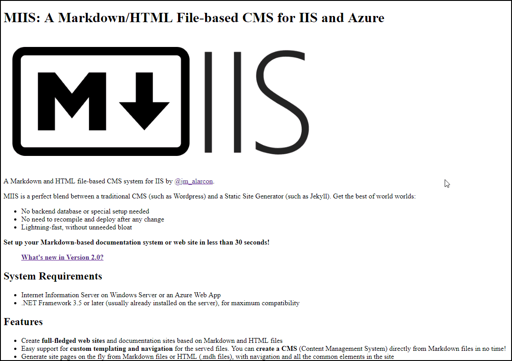

# Configuration settings and behavior for MIIS

You can change MIIS parameters in the `web.config` file in the root folder or in any sub-folder of the site serving your Markdown.

>Since ASP.NET configuration system is hierarchical, you can  have different settings in different sub-folders. This is very powerful if you want to change the navigation system, the template used in specific sub-folders, and so on. Take this into account when configuring your Markdown-based site.

## Default template - `cssfile` parameter

You can run MIIS **without any parameters** in your `web.config`. That will work, but the Markdown will be served as plain HTML. Files will look pretty ugly since no CSS is applied to beautify a little bit the output:



The **default template**, if no other one is set, simply returns the HTML5 version of the Markdown file without any CSS. But this default HTML content includes **a parameter called `cssfile`** that you can set to include a specific CSS file with every response. For example:

```
<add key="cssfile" value="~/CSS/github.css" />
```
This will use the Github styles in the returned HTML.

I've included **[several CSS files with MIIS](cssStyles.md)** for you to use immediately, and you can add your own anytime.

> **IMPORTANT**: notice how you can use the **relative path syntax** of ASP.NET, with a `~` at the beginning of the path, so that the resulting CSS is always pointing from the root of the application. If the Markdown is served from the root folder of the virtual server using `~/` or `/` will be the same thing. But if your Markdown app is hosted as a virtual app or virtual folder in IIS, this is very important to use.

## Using a full-blown template

You can serve the Markdown files using a full-fledged template with content parameters, navigation, etc...

The configuration parameter controlling this feature is called `Markdown-Template`:

```
<add key="Markdown-Template" value="~/Templates/Barebones/main.html"/>
```

This parameter allows you to point to an HTML file (or any other text file with HTML inside) that will be used to merge it's HTML with the HTML generated from the Markdown files.

This files can contain several parameters, standard or custom ones, to fine-tune the look and feel of the served Markdown.

There are **[several templates included](Template-List.md)** by default with MIIS.

## Behavior parameters
There are some specific aspects that you can control in the `web.config` file to change the extension's behavior:

- **`Markdown-Template`**: controls the look and feel and content distribution of the generated HTML from the Markdown contents. Read above to know more about it.
- **`UseMDCaching`**: By default, only the templates (see previous parameter) are cached, and the Markdown files are read from the file system every time they are requested. This is OK for most sites since they are small and with low traffic. If you have a lot of traffic and not very fast disks (no SSD) you can take advantage of this parameter to keep in memory a cached copy of every requested file. If you turn this feature on (`<add key="UseMDCaching" value ="1"/>`) then after the first request of a file it is cached in memory for faster access in the future. If the file changes, then the cache is automatically invalidated so that the new version is read again from disk automatically.
- **`allowDownloading`**: By default you can't download any Markdown file from the server. But sometimes it can be useful to allow your users to download the original Markdown files, to work on them or create new versions, etc... You can swicth on this feature through this parameter (`<add key="allowDownloading" value="1"/>`) to allow the files to be downloaded if you use the `?download=1` querystring parameter in the request. You can see this feature in practice if you enable this feature and us the "Barebones" template, that includes a link to download Markdown files in the footer of every document.
- **`UseEmoji`**: By default MIIS will not render standar Emoji codes like the ones used in Github, Trello, Slack, Basecamp and other software. Strings like `:smile:` or `:grin:` are not rendered as the corresponding emojis. You can turn this feature on easily and allow for them to be rendered. Just add this key: `<add key="UseEmoji" value="1" />`. You can have a list of the available Emojis [here](http://www.webpagefx.com/tools/emoji-cheat-sheet/).

## Custom parameters

Most of the content templates provided with this software offer their own custom parameters to customize a little more the final result. You can check them in the [custom templates document](Templating.md), but the most common ones are (all lowercase):

- **`sitetitle`**: The title for the site. It's normally used in the page's title before the title of the document, and it's commonly used in the main UI too.
- **`toc`**: It's used to define the name of the Markdown file used to create the main Table of Contents for the site. Some templates can have more than one ToC with similar names. And you can use a different value for this parameters in every sub-folder of the site, changing the navigation options depending on the location.
- **`copyright`**: The copyright or legal short sentence to show with the content. You can safely ignore it and leave it empty.

Some templates can have specific custom parameters to customize their contents or behavior. Check the templates' specific documentation or simply make a fast search for parameters in the form: `{.*?}` (regular expression), in the template's HTML file. You can set any of these parameters in the `web.config` file.

>**Note**: Remember: ASP.NET has a hierarchical configuration system. So you can add a different `web.config` for every sub-folder and have all the parameters customized differently per sub-folder.