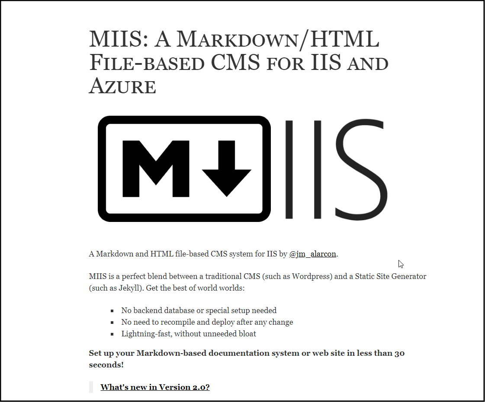
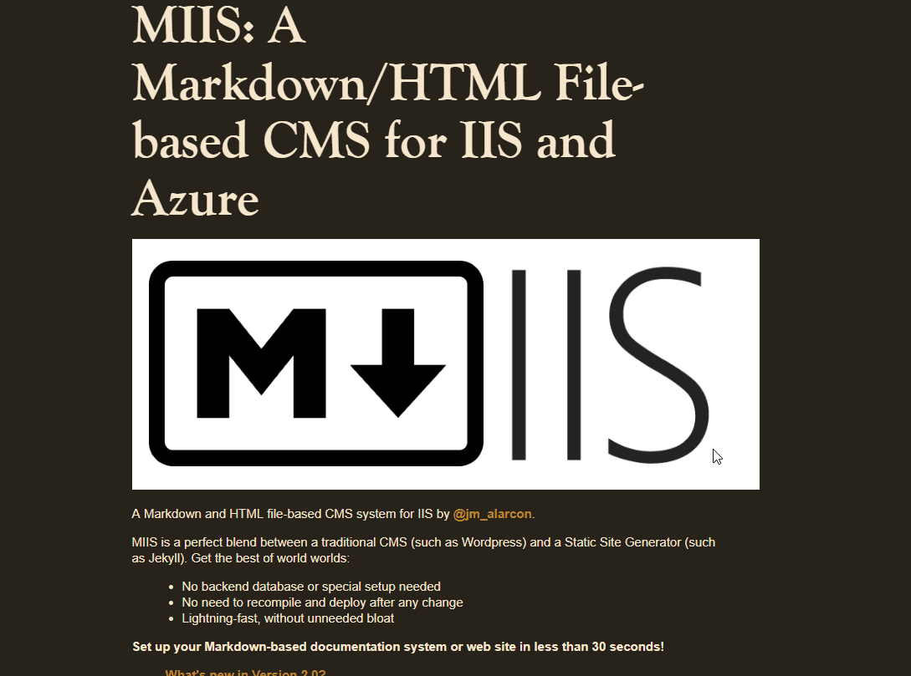

# CSS Styles included with MIIS

If you don't use a template and serve plain HTML from the Markdown, you can set the default style for the resulting files by setting the `cssfile` parameter in your `web.config`:

```
<add key="cssfile" value="~/CSS/github.css" />
```
I've included several .css files inside the CSS folder in the release folder of MIIS:

- **GitHub.css**: the same styles that Github uses for Markdown files.


- **markdown5.css**: big typeface, very easy to read. By [Jason Milkis](http://jasonm23.github.io/markdown-css-themes/){target=_blank}.



- **screen**: similar to the previous one, with dark background. By [Jason Milkis](http://jasonm23.github.io/markdown-css-themes/){target=_blank}.



And you can add yor own CSS file anytime. Simply add a CSS file anywhere and point the `cssfile` parameter to it in order to be applied.

>Notice how you can change the CSS file used in each sub-folder of your site simply setting a different value for the `cssfile` parameter in the `web.config` file of each one. That way you can have the root folder files rendered with a style, and files in any other sub-folder rendered with a totally different style.